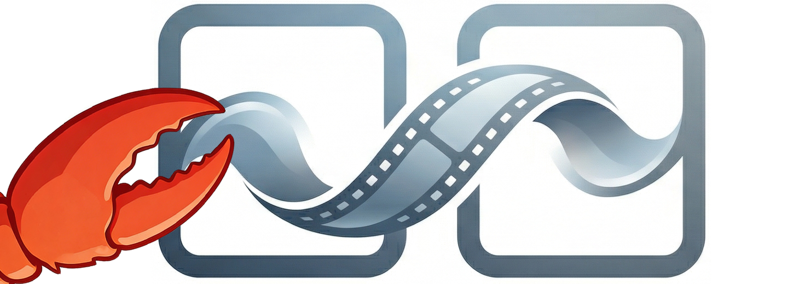
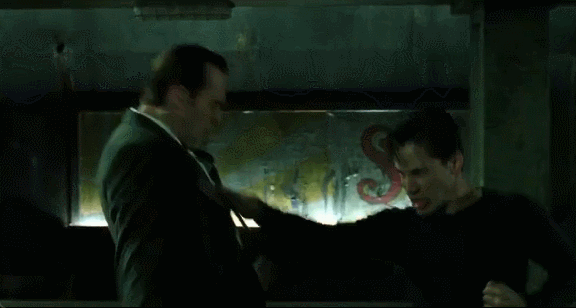
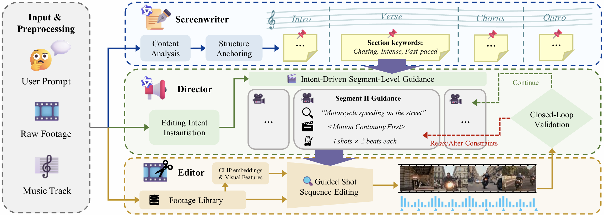

<div align="center">



# DIRECT-Claw: <ins>D</ins>ynamic <ins>I</ins>ntent for <ins>R</ins>etrieval & <br> <ins>E</ins>diting for <ins>C</ins>inematic <ins>T</ins>ransitions

### Video Mashup Creation via Hierarchical Multi-Agent Planning and Intent-Guided Editing

[](https://arxiv.org/abs/2604.04875)
[](https://github.com/AK-DREAM/DIRECT-Claw)
[](https://opensource.org/licenses/MIT)

</div>


**TL;DR:** DIRECT-Claw is a hierarchical multi-agent framework for automated **video mashup creation**. Given user instruction, raw video footage and a background music track, it autonomously edits a visually and rhythmically engaging video mashup (e.g. movie montage, anime music video) with cinematic visual continuity and auditory alignment.

#### 🚧 This repository is currently under construction. Our code and resources will be released soon.

## 🎬 Showcases
### Generated Video Clips (Seamless Visual Transitions🪄)
<table width="100%">
<tr>
  <td align="center" width="33%">
  
  </td>

  <td align="center" width="33%">
  
  </td>

  <td align="center" width="33%">
  
  </td>
</tr>
</table>

### Full-length Demo Videos (With Music🎵)
<table width="100%">
<tr>
  <td align="center" width="33%">
  <video src="https://github.com/user-attachments/assets/7b80aad5-b1ab-4511-aaba-5e429432814f" width="100%" controls ></video>
  </td>

  <td align="center" width="33%">
  <video src="https://github.com/user-attachments/assets/063bed64-782b-41de-81fe-496ea08b67f5" width="100%" controls ></video>
  </td>

  <td align="center" width="33%">
  <video src="https://github.com/user-attachments/assets/8f81ad74-86f7-4965-a1eb-5b85580dd454" width="100%" controls ></video>
  </td>
</tr>
</table>

## ⚙️ System Overview
<p align="center">
  
</p>

**DIRECT-Claw** adopts a multi-agent framework that integrates hierarchical planning and fine-grained video editing. For more details, please refer to our [arXiv preprint](https://arxiv.org/abs/2604.04875).

## 📝 Citation
If you find our work helpful, please consider citing:
```bibtex
@article{li2026direct,
  title={DIRECT: Video Mashup Creation via Hierarchical Multi-Agent Planning and Intent-Guided Editing}, 
  author={Li, Ke and Li, Maoliang and Chen, Jialiang and Chen, Jiayu and Zheng, Zihao and Wang, Shaoqi and Chen, Xiang},
  journal={arXiv preprint arXiv:2604.04875},
  year={2026}
}
```